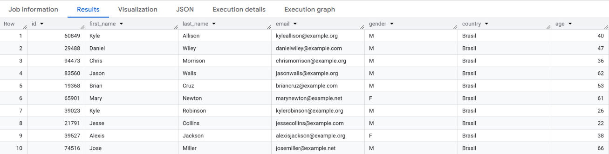
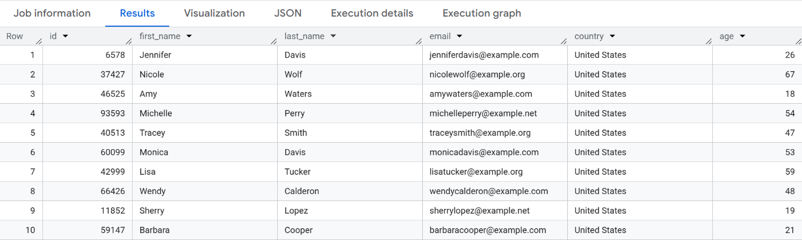
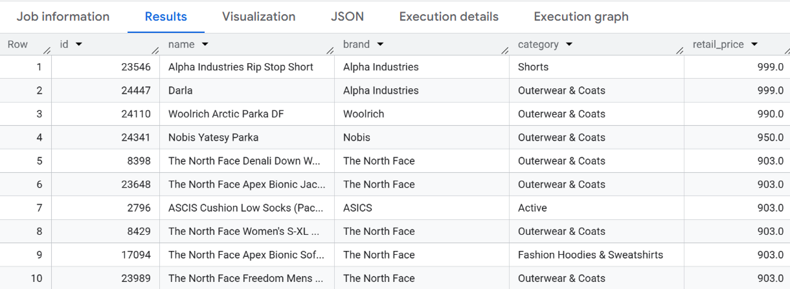
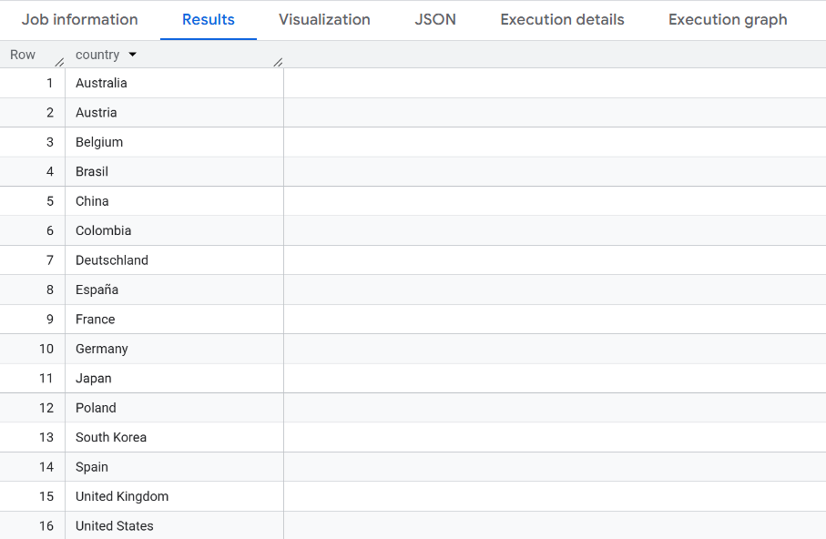
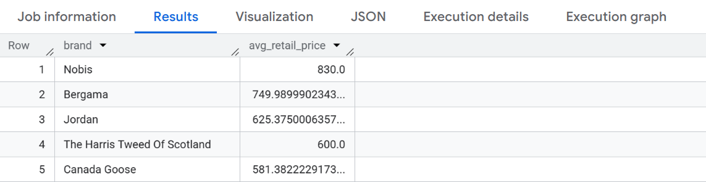
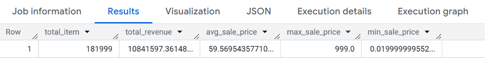
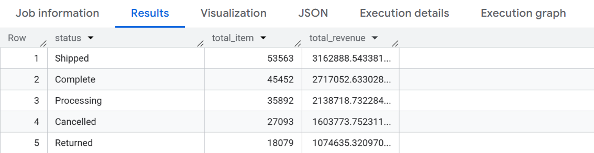
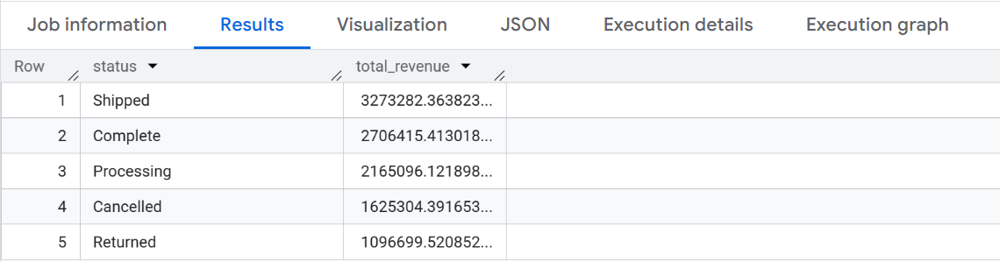

# Week 1 — SQL Foundations

[← Back to Main](../README.md)

Week 1 covers the building blocks of SQL: retrieving data, filtering rows, sorting results, and performing basic aggregations.

---

### Day 1 — `SELECT`, `FROM`, `LIMIT`

The data team needs a quick sample of customer data for initial exploration.

> Retrieve the first 10 rows from the `users` table.
> Columns: `id`, `first_name`, `last_name`, `email`, `gender`, `country`, `age`.

<details>
<summary>Solution</summary>

```sql

SELECT id, first_name, last_name, email, gender, country, age
FROM `bigquery-public-data.thelook_ecommerce.users`
LIMIT 10;

```

</details>

<details>
<summary>Output</summary>



</details>

---

### Day 2 — `WHERE`, `AND`

The marketing team wants to run a targeted campaign for female customers in the United States.

> Display all customers where `gender = 'F'` and `country = 'United States'`.
> Columns: `id`, `first_name`, `last_name`, `email`, `country`, `age`.

<details>
<summary>Solution</summary>

```sql

SELECT id, first_name, last_name, email, country, age
FROM bigquery-public-data.thelook_ecommerce.users
WHERE gender = 'F' AND country = 'United States';

```

</details>

<details>
<summary>Output</summary>



</details>

---

### Day 3 — `ORDER BY`

The product team wants to identify the most and least expensive items in the catalog.

> Display all products sorted by price from **most expensive to least expensive**.
> Columns: `id`, `name`, `brand`, `category`, `retail_price`.

<details>
<summary>Solution</summary>

```sql

SELECT id, name, brand, category, retail_price
FROM `bigquery-public-data.thelook_ecommerce.products`
ORDER BY retail_price DESC;

```

</details>

<details>
<summary>Output</summary>



</details>

---

### Day 4 — `DISTINCT`, `GROUP BY`

The team needs to know which countries are represented in the database and which brands are the most premium.

> a) Display a unique list of countries from the `users` table, sorted alphabetically.
>
> b) Display the top 5 brands by highest average `retail_price`.

<details>
<summary>Solution</summary>

```sql
-- Day 4a: DISTINCT

SELECT DISTINCT(country)
FROM `bigquery-public-data.thelook_ecommerce.users`
ORDER BY country;

-- Day 4b: GROUP BY + ORDER BY + LIMIT

SELECT brand, 
        AVG(retail_price) AS avg_retail_price
FROM `bigquery-public-data.thelook_ecommerce.products`
GROUP BY brand
ORDER BY avg_retail_price DESC
LIMIT 5;
```

</details>

<details>
<summary>Output</summary>

**Part a — Unique Countries**

 
**Part b — Top 5 Brands by Average Price**


</details>

---

### Day 5 — Aggregate Functions

The manager needs an overall business statistics summary for the monthly meeting.

> From the `order_items` table, calculate in **a single result row**:
> total items (`COUNT`), total revenue (`SUM`), average price (`AVG`), highest price (`MAX`), lowest price (`MIN`).

<details>
<summary>Solution</summary>

```sql

SELECT COUNT(inventory_item_id) AS total_item,
        SUM(sale_price) AS total_revenue,
        AVG(sale_price) AS avg_sale_price,
        MAX(sale_price) AS max_sale_price,
        MIN(sale_price) AS min_sale_price
FROM `bigquery-public-data.thelook_ecommerce.order_items`;

```

</details>

<details>
<summary>Output</summary>



</details>

---

### Day 6 — `GROUP BY`

The business team wants to see sales performance broken down by product category.

> From the `order_items` table, display the category name, number of items sold, total revenue, and average price per category.
> Sort by **highest revenue**.

<details>
<summary>Solution</summary>

```sql
-- Day 6: GROUP BY
```

</details>

<details>
<summary>Output</summary>



</details>

---

### Day 7 — `HAVING`

The analysis should only focus on categories that have already generated significant revenue.

> Display product categories with their total revenue, **only for categories where total revenue exceeds $50,000**.
> Sort by highest revenue.

<details>
<summary>Solution</summary>

```sql
-- Day 7: HAVING
```

</details>

<details>
<summary>Output</summary>



</details>

---

[← Back to Main](../README.md) | [Week 2 →](../week2/)
