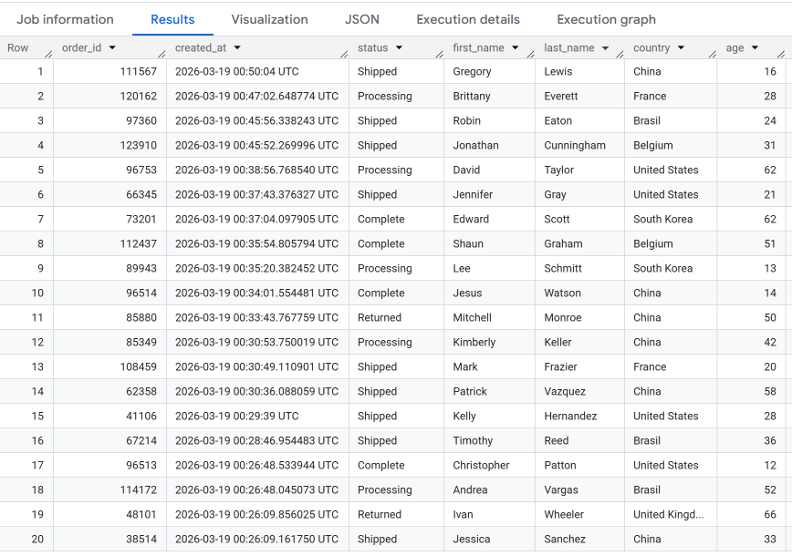
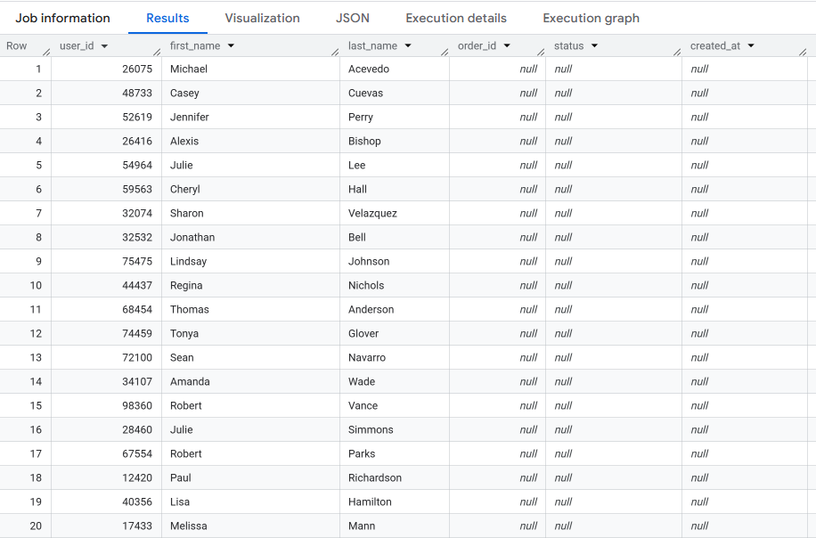
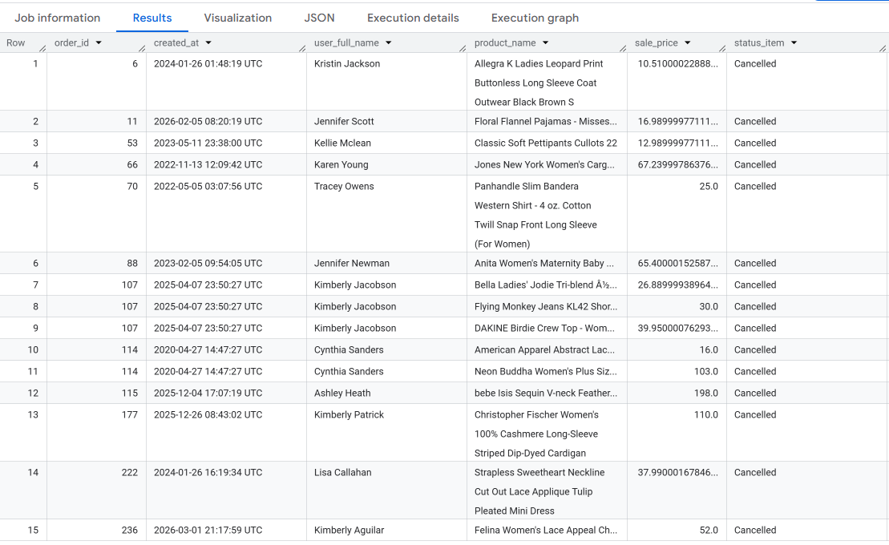
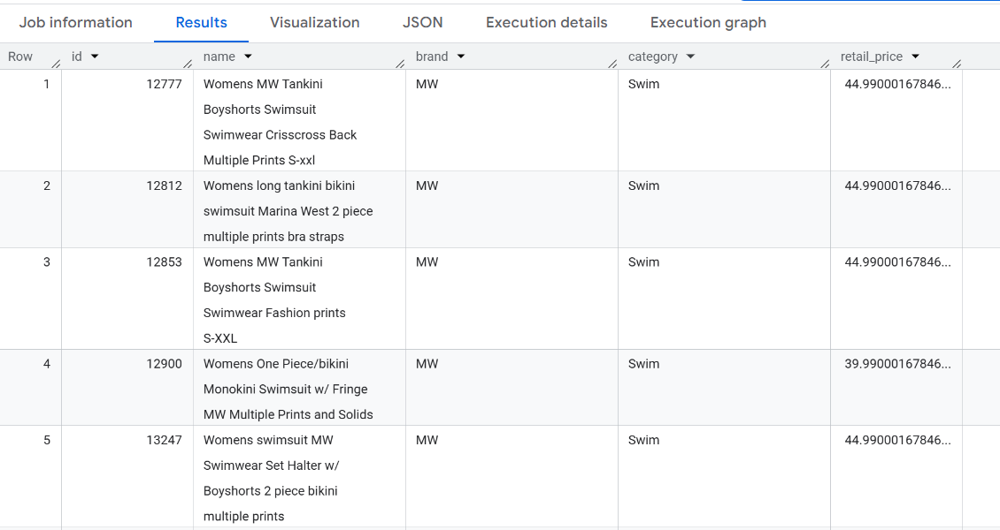
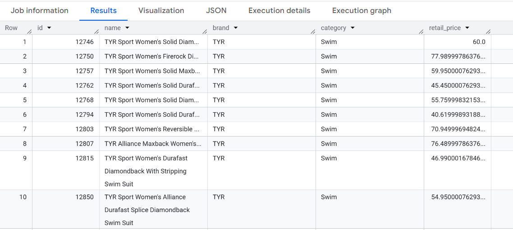
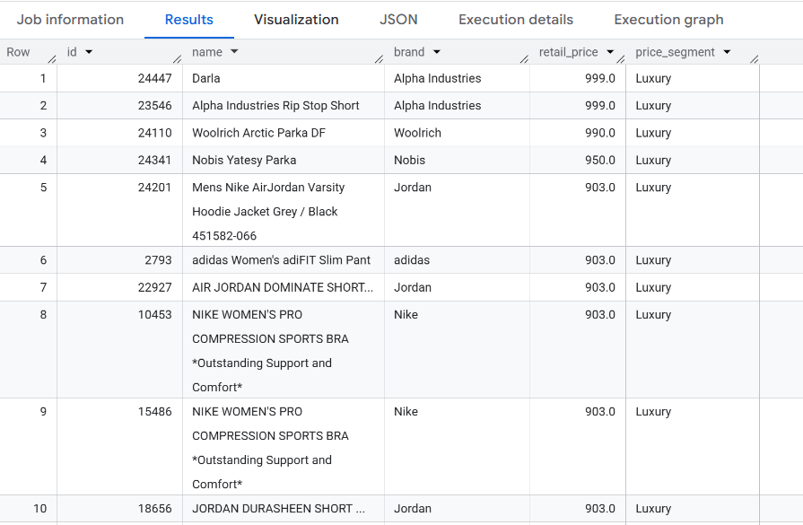

# Week 2 — JOINs & Intermediate Filtering

[← Back to Main](../README.md)

Week 2 focuses on combining tables with various JOIN types, advanced filtering, data transformation with CASE WHEN, and handling NULL values.

---

### Day 8 — `INNER JOIN`

The team needs to combine order data with customer information for a shipping report.

> Join the `orders` and `users` tables.
> Display: `order_id`, `created_at`, `status`, `first_name`, `last_name`, `country`, `age`.
> Return the **20 most recent rows** based on `created_at`.

<details>
<summary>Solution</summary>

```sql

SELECT o.order_id,
      o.created_at,
      o.status,
      u.first_name,
      u.last_name,
      u.country, 
      u.age
FROM `bigquery-public-data.thelook_ecommerce.orders` AS o
INNER JOIN `bigquery-public-data.thelook_ecommerce.users` AS u
ON o.user_id = u.id
ORDER BY created_at DESC
LIMIT 20;

```

</details>

<details>
<summary>Output</summary>



</details>

---

### Day 9 — `LEFT JOIN`

The CRM team wants to identify customers who have registered but never placed an order.

> Display all `users` along with their order data. Customers who have never ordered should still appear (order columns = NULL).
> Columns: `user_id`, `first_name`, `last_name`, `order_id`, `status`, `created_at`.

<details>
<summary>Solution</summary>

```sql

SELECT u.id AS user_id,
      u.first_name,
      u.last_name,
      o.order_id,
      o.status,
      o.created_at
FROM `bigquery-public-data.thelook_ecommerce.users` AS u
LEFT JOIN `bigquery-public-data.thelook_ecommerce.orders` AS o
ON u.id = o.user_id;

```

</details>

<details>
<summary>Output</summary>



</details>

---

### Day 10 — Multiple JOINs

A detailed sales report requires information from multiple tables at once.

> Join `orders`, `users`, `order_items`, and `products` in a single query.
> Display: `order_id`, `created_at`, user's full name, product name, `sale_price`, item status.
> Return the first 15 rows.

<details>
<summary>Solution</summary>

```sql

SELECT o.order_id,
      o.created_at,
      CONCAT(u.first_name, ' ', u.last_name) AS user_full_name,
      p.name AS product_name,
      oi.sale_price,
      oi.status AS status_item
FROM `bigquery-public-data.thelook_ecommerce.orders` AS o
INNER JOIN `bigquery-public-data.thelook_ecommerce.users` AS u
 ON o.user_id = u.id
INNER JOIN `bigquery-public-data.thelook_ecommerce.order_items` AS oi
 ON o.order_id = oi.order_id
INNER JOIN `bigquery-public-data.thelook_ecommerce.products` AS p
 ON oi.product_id = p.id
LIMIT 15;

```

</details>

<details>
<summary>Output</summary>



</details>

---

### Day 11 — `LIKE`, Wildcards

The product team wants to search for products based on name patterns.

> a) Find all products whose name contains the word **"Women"** (case-insensitive).
>
> b) Find all products whose name **starts with the letter "T"**.
>
> Columns: `id`, `name`, `brand`, `category`, `retail_price`.

<details>
<summary>Solution</summary>

```sql

-- Day 11a: LIKE '%Women%'

SELECT id,
      name,
      brand,
      category,
      retail_price
FROM `bigquery-public-data.thelook_ecommerce.products`
WHERE LOWER(name) LIKE '%women%';

-- Day 11b: LIKE 'T%'

SELECT brand, 
        AVG(retail_price) AS avg_retail_price
FROM `bigquery-public-data.thelook_ecommerce.products`
GROUP BY brand
ORDER BY avg_retail_price DESC
LIMIT 5;

```

</details>

<details>
<summary>Output</summary>

**Part a — LIKE '%Women%'**

 
**Part b — LIKE 'T%'**


</details>

---

### Day 12 — `IN`, `BETWEEN`, Date Filter

Analyze Q4 orders from specific countries.

> a) Display all `orders` created **between October 1 and December 31, 2023**.
>
> b) Display `users` from **China, Brazil, or Germany**.

<details>
<summary>Solution</summary>

```sql
-- Day 12a: BETWEEN (date filter)


-- Day 12b: IN
```

</details>

<details>
<summary>Output</summary>


</details>

---

### Day 13 — `CASE WHEN`

The pricing team wants to segment products by price range for a discount strategy.

> From the `products` table, add a `price_segment` column:
> - `< $20` → **Budget**
> - `$20–$99` → **Mid-Range**
> - `$100–$299` → **Premium**
> - `≥ $300` → **Luxury**
>
> Columns: `id`, `name`, `brand`, `retail_price`, `price_segment`. Sort by highest price.

<details>
<summary>Solution</summary>

```sql
-- Day 13: CASE WHEN
```

</details>

<details>
<summary>Output</summary>



</details>

---

### Day 14 — NULL Handling, `COALESCE`

Data needs to be cleaned before it can be used for further analysis.

> a) Display all `users` where the `age` column is **NULL**.
>
> b) Display all `users` and replace NULL in `age` with `0`, and NULL in `country` with `'Unknown'` using `COALESCE`.

<details>
<summary>Solution</summary>

```sql
-- Day 14a: IS NULL


-- Day 14b: COALESCE
```

</details>

<details>
<summary>Output</summary>


</details>

---

[← Week 1](../week1/) | [Back to Main](../README.md) | [Week 3 →](../week3/)
