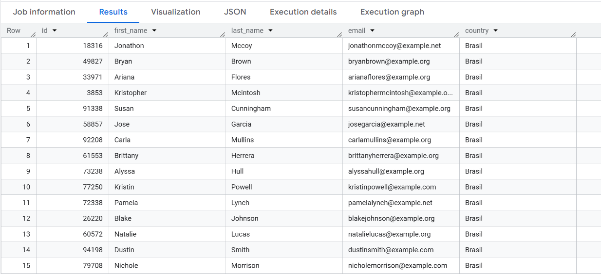
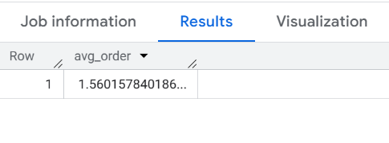
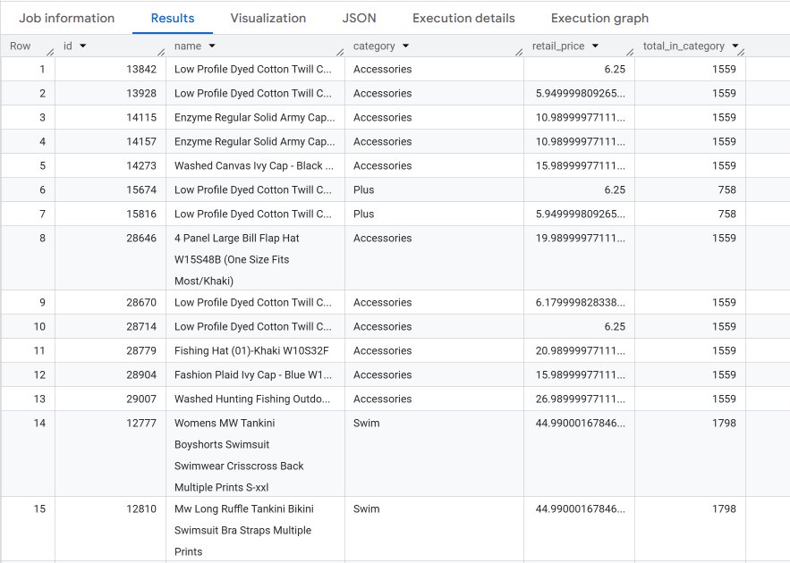
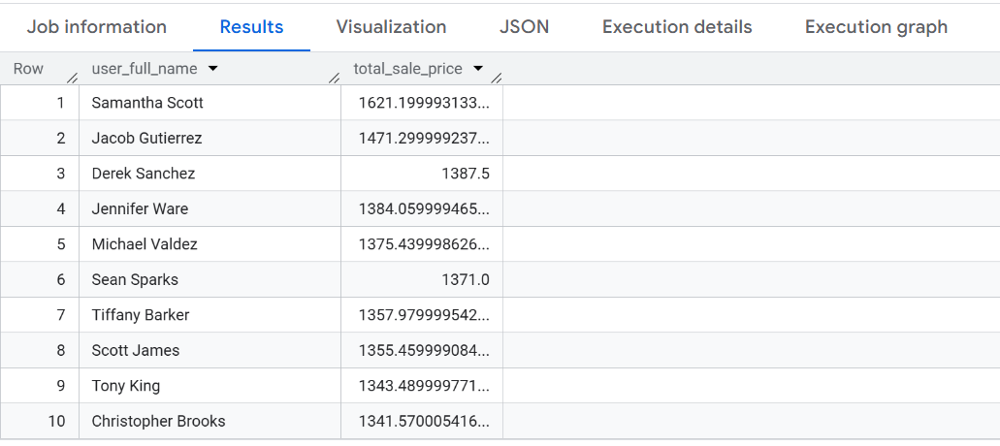
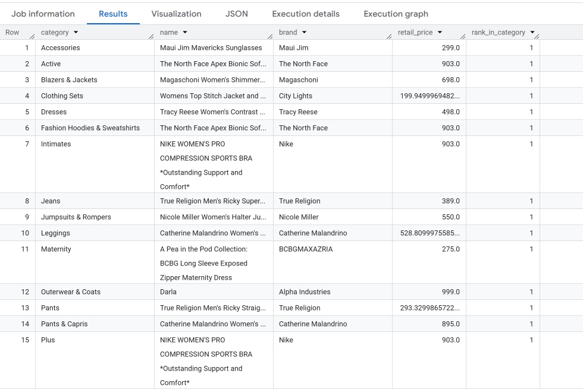
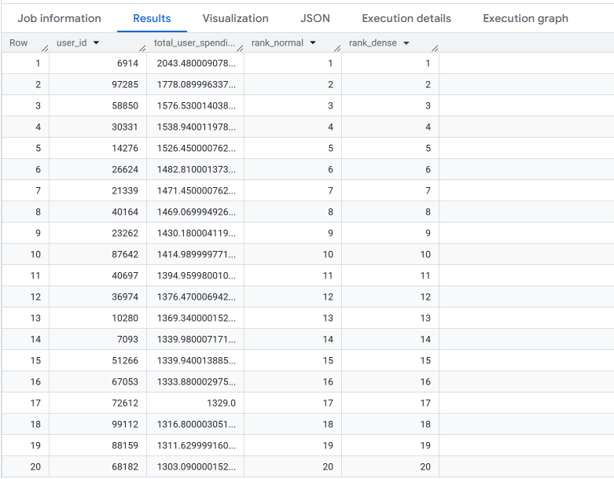
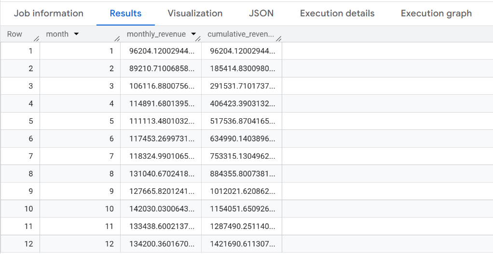

# Week 3 — Subquery & CTE

[← Back to Main](../README.md)

Week 3 focuses on multi-level queries: subqueries in different positions, CTEs to simplify complex logic, and window functions for advanced analytics.

---

### Day 15 — Subquery in `WHERE`

The sales team wants to focus only on customers who have already made a transaction.

> Display all `users` who have **placed at least 1 order**.
> Columns: `id`, `first_name`, `last_name`, `email`, `country`.

<details>
<summary>Solution</summary>

```sql

SELECT id,
      first_name,
      last_name,
      email,
      country
FROM `bigquery-public-data.thelook_ecommerce.users`
WHERE id IN (SELECT user_id
      FROM `bigquery-public-data.thelook_ecommerce.orders`)

```

</details>

<details>
<summary>Output</summary>



</details>

---

### Day 16 — Subquery in `FROM`

Management wants to know the average order activity per customer.

> Calculate the **average number of orders per user** using a subquery in `FROM`.

<details>
<summary>Solution</summary>

```sql

SELECT
      AVG(total_order) AS avg_order
FROM (
      SELECT user_id,
            COUNT(order_id) AS total_order
      FROM `bigquery-public-data.thelook_ecommerce.orders`
      GROUP BY user_id
      ) order_summary;

```

</details>

<details>
<summary>Output</summary>



</details>

---

### Day 17 — Correlated Subquery

Each product needs to be displayed alongside the context of its category.

> From the `products` table, display each product along with the **total number of products in the same category** as an additional column.
> Columns: `id`, `name`, `category`, `retail_price`, `total_in_category`. Show 20 rows.

<details>
<summary>Solution</summary>

```sql

SELECT id,
      name,
      category,
      retail_price,
      (SELECT COUNT(*)
            FROM `bigquery-public-data.thelook_ecommerce.products` AS p2
            WHERE p1.category = p2.category) AS total_in_category
FROM `bigquery-public-data.thelook_ecommerce.products` AS p1
LIMIT 20;

```

</details>

<details>
<summary>Output</summary>



</details>

---

### Day 18 — CTE (`WITH`)

The team wants a VIP customer report based on total spending.

> Use a CTE to calculate total `sale_price` per user, then display the **TOP 10** customers with the highest spending along with their full names.

<details>
<summary>Solution</summary>

```sql

WITH user_spending AS (
      SELECT user_id,
            SUM(sale_price) AS total_sale_price
      FROM `bigquery-public-data.thelook_ecommerce.order_items`
      GROUP BY user_id
)
SELECT CONCAT(u.first_name, ' ', u.last_name) AS user_full_name,
      us.total_sale_price
FROM user_spending AS us
INNER JOIN `bigquery-public-data.thelook_ecommerce.users` AS u
      ON us.user_id = u.id
ORDER BY us.total_sale_price DESC
LIMIT 10;

```

</details>

<details>
<summary>Output</summary>



</details>

---

### Day 19 — `ROW_NUMBER()`

The merchandising team wants to know the most expensive product in each category.

> Use `ROW_NUMBER()` to rank products by price within each category. Display only the **product ranked #1** per category.
> Columns: `category`, `name`, `brand`, `retail_price`, `rank_in_category`.

<details>
<summary>Solution</summary>

```sql
-- Day 19: ROW_NUMBER() OVER (PARTITION BY category)
```

</details>

<details>
<summary>Output</summary>



</details>

---

### Day 20 — `RANK()`, `DENSE_RANK()`

A customer leaderboard based on total purchases, handling tied values properly.

> Calculate total purchases per user from `order_items`. Create two ranking columns: `rank_normal` (RANK) and `rank_dense` (DENSE_RANK). Display the **TOP 20**.

<details>
<summary>Solution</summary>

```sql
-- Day 20: RANK() vs DENSE_RANK()
```

</details>

<details>
<summary>Output</summary>



</details>

---

### Day 21 — Running Total (`SUM OVER`)

The CFO wants to see the cumulative monthly revenue throughout 2023.

> From `order_items`, calculate the **monthly revenue** and **cumulative revenue** from January to December 2023.
> Columns: `month`, `monthly_revenue`, `cumulative_revenue`.

<details>
<summary>Solution</summary>

```sql
-- Day 21: SUM() OVER (ORDER BY month) — Running Total
```

</details>

<details>
<summary>Output</summary>



</details>

---

[← Week 2](../week2/) | [Back to Main](../README.md) | [Week 4 →](../week4/)
