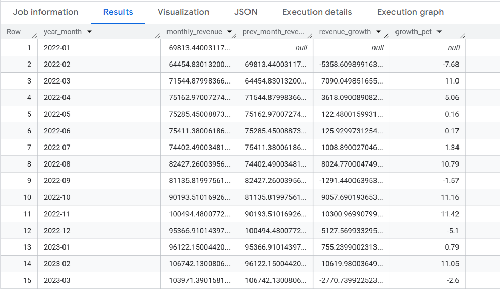
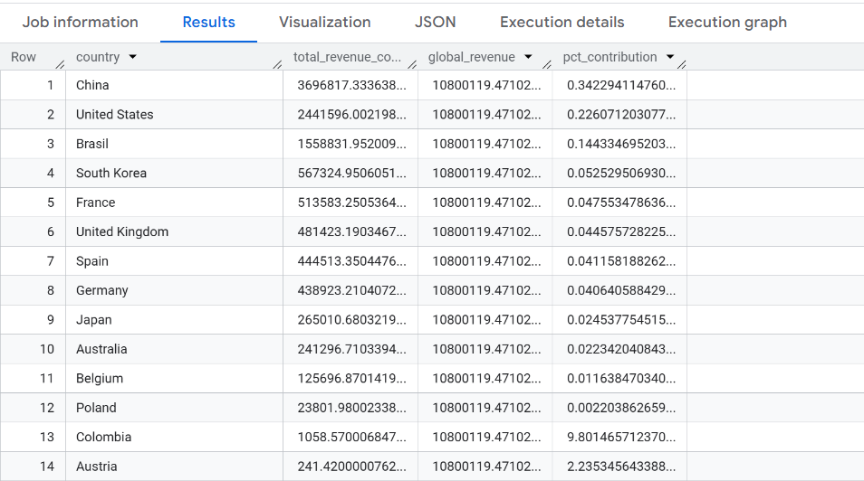
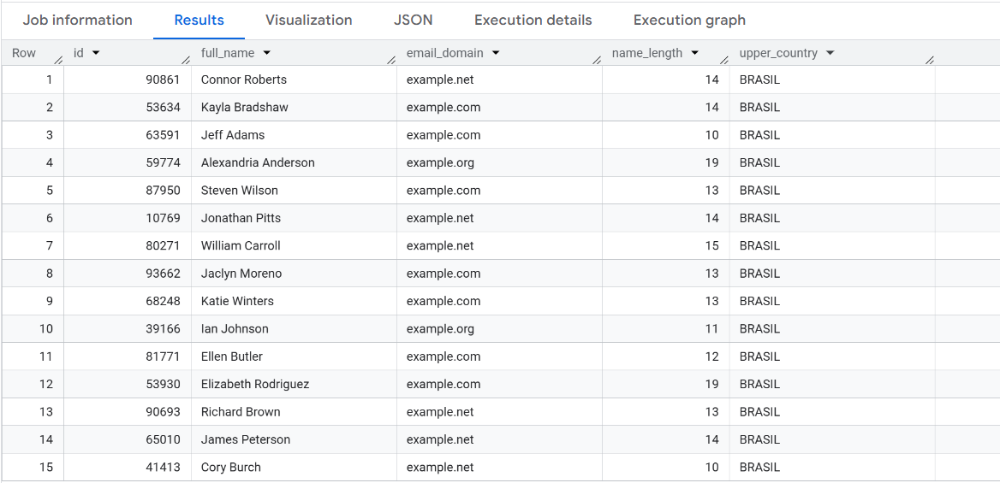
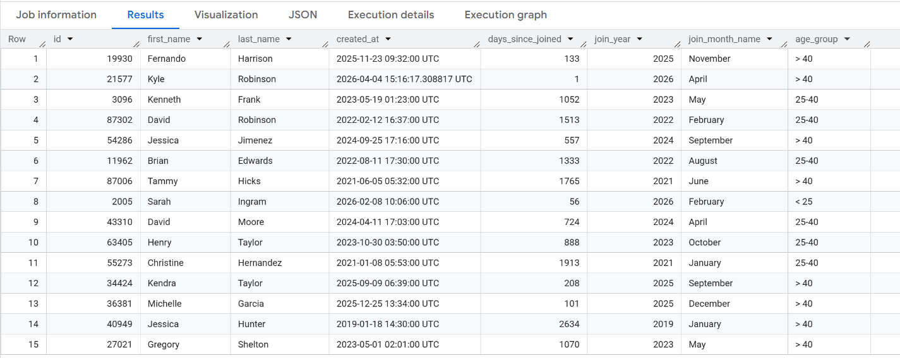
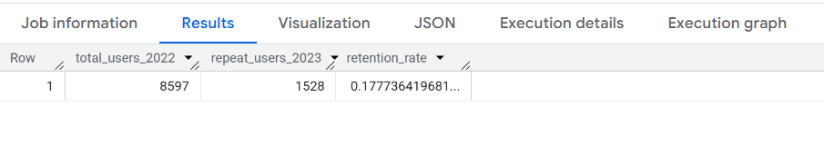
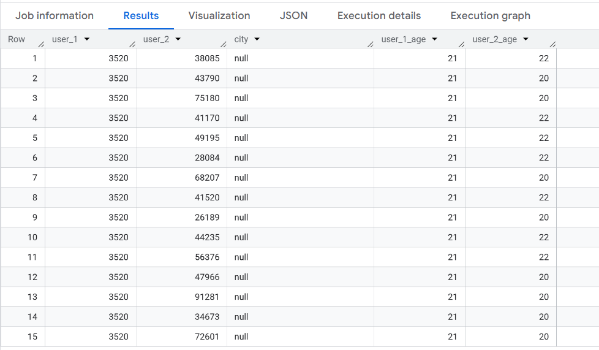
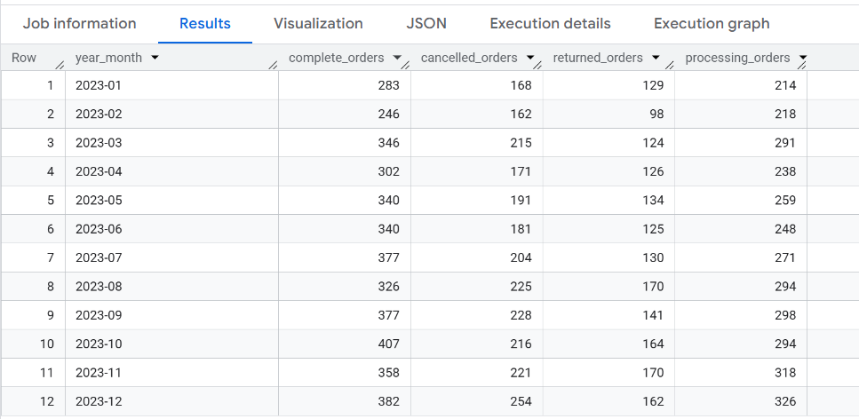

# Week 4 — Advanced SQL

[← Back to Main](../README.md)

The final week covers advanced SQL techniques: complex window functions, string and date manipulation, query optimization, and a full end-to-end business analysis mini project.

---

### Day 22 — `LAG()`, `LEAD()`

The finance team wants to compare monthly revenue performance against the previous month.

> Calculate revenue per month (2022–2023), then add columns for `prev_month_revenue`, `revenue_growth`, and `growth_pct` (month-over-month growth percentage).

<details>
<summary>Solution</summary>

```sql

WITH monthly AS (
  SELECT 
    FORMAT_DATE('%Y-%m', DATE(created_at)) AS year_month,
    SUM(sale_price) AS monthly_revenue
  FROM `bigquery-public-data.thelook_ecommerce.order_items`
  WHERE EXTRACT(YEAR FROM created_at) IN (2022, 2023)
  GROUP BY year_month
),
lagged AS (
  SELECT year_month,
    monthly_revenue,
    LAG(monthly_revenue) OVER (ORDER BY year_month) AS prev_month_revenue
  FROM monthly
)
SELECT year_month,
  monthly_revenue,
  prev_month_revenue,
  monthly_revenue - prev_month_revenue AS revenue_growth,
  ROUND(
    SAFE_DIVIDE(monthly_revenue - prev_month_revenue,prev_month_revenue) * 100, 2
    ) AS growth_pct
FROM lagged
ORDER BY year_month;

```

</details>

<details>
<summary>Output</summary>



</details>

---

### Day 23 — `PARTITION BY`

The regional team wants to see each country's revenue contribution against the global total.

> Calculate `total_revenue` per country, `global_revenue` (all countries combined), and `pct_contribution` (contribution percentage).
> Display the **TOP 15 countries**.

<details>
<summary>Solution</summary>

```sql

WITH country_revenue AS (
  SELECT u.country,
    SUM(oi.sale_price) AS total_revenue_country
  FROM `bigquery-public-data.thelook_ecommerce.order_items` AS oi
  INNER JOIN `bigquery-public-data.thelook_ecommerce.users` AS u
    ON oi.user_id = u.id
  GROUP BY country
)
SELECT country,
  total_revenue_country,
  SUM(total_revenue_country) OVER () AS global_revenue,
  SAFE_DIVIDE(total_revenue_country, SUM(total_revenue_country) OVER ()) AS pct_contribution
FROM country_revenue
ORDER BY total_revenue_country DESC
LIMIT 15;

```

</details>

<details>
<summary>Output</summary>



</details>

---

### Day 24 — String Functions

The data engineering team needs text column transformation and normalization.

> From the `users` table, create the following columns:
> - `full_name` → first and last name combined
> - `email_domain` → domain extracted from email (e.g. `gmail.com`)
> - `name_length` → character length of full_name
> - `upper_country` → country name in all uppercase
>
> Display 15 rows.

<details>
<summary>Solution</summary>

```sql

SELECT id,
  CONCAT(first_name, ' ', last_name) AS full_name,
  SUBSTR(email, STRPOS(email, '@') + 1) AS email_domain,
  LENGTH(CONCAT(first_name, ' ', last_name)) AS name_length,
  UPPER(country) AS upper_country
FROM `bigquery-public-data.thelook_ecommerce.users`
LIMIT 15;

```

</details>

<details>
<summary>Output</summary>



</details>

---

### Day 25 — Date & Time Functions

Analyze customer loyalty based on how long they've been registered and their age group.

> From the `users` table, display:
> - `days_since_joined` → days since the customer registered
> - `join_year` → year of registration
> - `join_month_name` → month name of registration
> - `age_group` → age category: `< 25`, `25–40`, `> 40`

<details>
<summary>Solution</summary>

```sql

SELECT id,
  first_name,
  last_name,
  created_at,
  DATE_DIFF(CURRENT_DATE(), DATE(created_at), DAY) AS days_since_joined,
  EXTRACT(YEAR FROM created_at) AS join_year,
  FORMAT_DATE('%B', DATE(created_at)) AS join_month_name,
  CASE
    WHEN age < 25 THEN '< 25'
    WHEN age >= 25 AND age <= 40 THEN '25-40'
    ELSE '> 40'
    END AS age_group
FROM `bigquery-public-data.thelook_ecommerce.users`

```

</details>

<details>
<summary>Output</summary>



</details>

---

### Day 26 — Multiple CTEs Chaining

A simple cohort analysis to measure customer retention across years.

> Of customers who **placed their first order in 2022**, what percentage **returned to order again in 2023**?
> Use 3 chained CTEs: `first_order_2022` → `repeat_in_2023` → `cohort_summary`.

<details>
<summary>Solution</summary>

```sql

WITH users_first_order_2022 AS (
  SELECT
  user_id,
  MIN(DATE(created_at)) as first_order_date
  FROM `bigquery-public-data.thelook_ecommerce.orders`
  GROUP BY user_id
  HAVING EXTRACT(YEAR FROM MIN(DATE(created_at))) = 2022 
),
users_repeat_2023 AS (
  SELECT
  DISTINCT ufo.user_id
  FROM users_first_order_2022 AS ufo
  INNER JOIN `bigquery-public-data.thelook_ecommerce.orders` AS o
    ON ufo.user_id = o.user_id
  WHERE EXTRACT(YEAR FROM o.created_at) = 2023
),
cohort_summary AS (
  SELECT
  (SELECT COUNT(*) FROM users_first_order_2022) AS total_users_2022,
  (SELECT COUNT(*) FROM users_repeat_2023) AS repeat_users_2023,
  SAFE_DIVIDE(
    (SELECT COUNT(*) FROM users_repeat_2023), (SELECT COUNT(*) FROM users_first_order_2022)
  ) AS retention_rate
)
SELECT *
FROM cohort_summary;

```

</details>

<details>
<summary>Output</summary>



</details>

---

### Day 27 — Self JOIN

Find pairs of customers with similar characteristics from the same city.

> Use a Self JOIN on the `users` table to find pairs of customers who are from the **same city** and have an **age difference of exactly 1 year**. Display 15 rows.

<details>
<summary>Solution</summary>

```sql
-- Day 27: Self JOIN
```

</details>

<details>
<summary>Output</summary>



</details>

---

### Day 28 — PIVOT with `CASE WHEN`

Management wants a summary of order counts by status in a pivot table format.

> Build a pivot table from the `orders` table showing the number of orders per status (`Complete`, `Cancelled`, `Returned`, `Processing`) for each month in 2023.

<details>
<summary>Solution</summary>

```sql
-- Day 28: Manual PIVOT with SUM(CASE WHEN ...)
```

</details>

<details>
<summary>Output</summary>



</details>

---

### Day 29 — Query Optimization

Increasingly complex analytical queries need to be optimized to run efficiently in BigQuery.

> a) Write a query to calculate **total revenue per brand per category** (status = `Complete`).
>
> b) Optimize the query: apply early filters, avoid `SELECT *`, and separate logic using CTEs.
>
> c) Record the **bytes processed** before and after optimization from the Execution Details tab in BigQuery.

<details>
<summary>Solution</summary>

```sql
-- Day 29a: Original Query


-- Day 29b: Optimized Query (CTE + early filter)
```

</details>

<details>
<summary>Output</summary>


</details>

---

### Day 30 — Mini Project: End-to-End Business Analysis

A comprehensive business analysis as the final challenge — ready to be showcased as a portfolio piece.

> Build a complete analysis in 4 parts:
>
> **Part 1 — Revenue Trend (2022–2023)**
> Monthly revenue, MoM growth, and cumulative revenue.
>
> **Part 2 — Top 10 Customers**
> Highest-spending customers with their country, total orders, and average order value.
>
> **Part 3 — Product Performance**
> Top 5 categories by revenue + top 3 best-selling products per category.
>
> **Part 4 — Order Status Summary**
> Order status distribution with percentage breakdown and total revenue per status.

<details>
<summary>Solution</summary>

```sql
-- Part 1: Revenue Trend


-- Part 2: Top 10 Customers


-- Part 3: Product Performance


-- Part 4: Order Status Summary
```

</details>

<details>
<summary>Output</summary>


</details>

---

[← Week 3](../week3/) | [Back to Main](../README.md)
